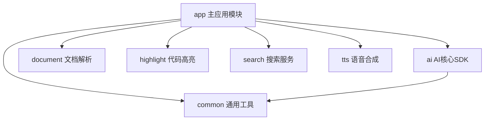
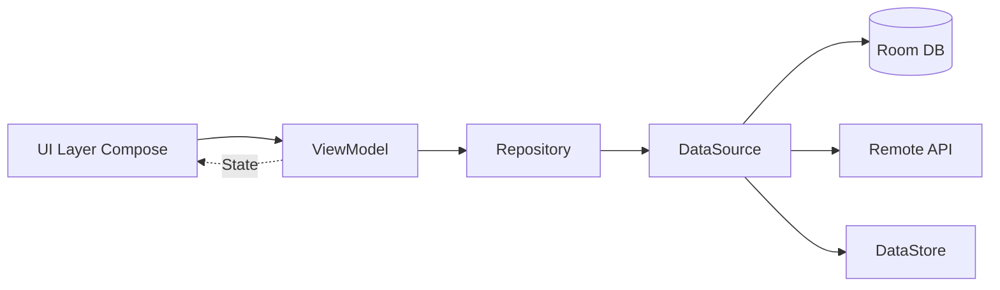

# RikkaHub 项目分析报告

## 📋 项目概览

**项目名称**: RikkaHub  
**项目类型**: 原生Android应用  
**主要功能**: 多AI提供商LLM聊天客户端  
**开发语言**: Kotlin  
**最新版本**: 1.6.11 (versionCode: 110)  
**最低SDK版本**: 26 (Android 8.0)  
**目标SDK版本**: 36

### 项目定位

RikkaHub是一个支持多AI提供商的Android原生聊天客户端，采用Material You设计规范，具备完整的多模态输入、MCP支持、搜索功能等特性。

---

## 🏗️ 架构设计

### 模块化架构



### 核心模块职责

#### 1. **app模块** - 主应用
- UI层(Jetpack Compose)
- 导航管理(Navigation Compose)
- 依赖注入(Koin)
- 数据持久化(Room + DataStore)
- 业务逻辑协调

#### 2. **ai模块** - AI SDK核心
- 多AI提供商适配(OpenAI、Google、Anthropic)
- 消息流式处理(SSE)
- API请求封装
- 响应解析与类型适配

#### 3. **document模块** - 文档处理
- PDF解析(MuPDF)
- DOCX解析
- 文档内容提取

#### 4. **search模块** - 搜索服务集成
支持的搜索提供商:
- Exa Search
- Tavily
- Zhipu
- LinkUp
- Brave Search
- Perplexity
- Bing
- Metaso
- SearXNG
- Firecrawl
- Jina
- Bocha
- Ollama

#### 5. **highlight模块** - 代码高亮
- 语法高亮显示
- 多语言支持

#### 6. **tts模块** - 文字转语音
- 音频播放控制
- 文本分块处理
- TTS控制器

#### 7. **common模块** - 通用工具
- 共享工具类
- 扩展函数
- 常量定义

---

## 🛠️ 技术栈详解

### UI层技术

| 技术 | 版本 | 用途 |
|------|------|------|
| **Jetpack Compose** | BOM 2025.08.01 | 声明式UI框架 |
| **Material 3** | 1.4.0-alpha18 | Material Design组件 |
| **Material 3 Adaptive** | 1.2.0-beta01 | 自适应布局 |
| **Navigation Compose** | 2.9.3 | 导航管理 |
| **Lucide Icons** | 1.1.0 | 图标库 |
| **Coil 3** | 3.3.0 | 图片加载 |

### 数据层技术

| 技术 | 版本 | 用途 |
|------|------|------|
| **Room** | 2.7.2 | SQLite数据库ORM |
| **DataStore** | 1.1.7 | 偏好设置存储 |
| **Paging 3** | 3.3.6 | 分页加载 |
| **Koin** | 4.1.1 | 依赖注入 |

### 网络层技术

| 技术 | 版本 | 用途 |
|------|------|------|
| **OkHttp** | 5.1.0 | HTTP客户端 |
| **OkHttp SSE** | 5.1.0 | 服务器推送事件 |
| **Retrofit** | 3.0.0 | REST API封装 |
| **Ktor Client** | 3.3.0 | 异步HTTP客户端 |

### 序列化与解析

| 技术 | 版本 | 用途 |
|------|------|------|
| **kotlinx.serialization** | 1.9.0 | JSON序列化 |
| **Jetbrains Markdown** | 0.7.3 | Markdown解析 |
| **JSoup** | 1.21.2 | HTML解析 |
| **Pebble** | 3.2.4 | 模板引擎 |

### 其他核心库

| 技术 | 版本 | 用途 |
|------|------|------|
| **MCP SDK** | 0.7.2 | Model Context Protocol |
| **Firebase** | 34.2.0 | 分析与崩溃报告 |
| **JLatexMath** | 1.2 | LaTeX公式渲染 |
| **WorkManager** | 2.10.3 | 后台任务调度 |
| **ZXing** | 3.5.3 | 二维码处理 |

---

## 📂 项目结构分析

### 核心目录结构

```
AIfriend/
├── app/                          # 主应用模块
│   ├── src/main/
│   │   ├── java/me/rerere/rikkahub/
│   │   │   ├── RikkaHubApp.kt   # Application入口
│   │   │   ├── RouteActivity.kt # 主Activity
│   │   │   ├── data/            # 数据层
│   │   │   │   ├── ai/          # AI相关数据
│   │   │   │   ├── api/         # API定义
│   │   │   │   ├── datastore/   # 偏好设置
│   │   │   │   ├── db/          # Room数据库
│   │   │   │   ├── model/       # 数据模型
│   │   │   │   ├── repository/  # 仓储层
│   │   │   │   └── sync/        # 同步逻辑
│   │   │   ├── di/              # 依赖注入配置
│   │   │   ├── service/         # 服务层
│   │   │   ├── ui/              # UI层
│   │   │   │   ├── activity/
│   │   │   │   ├── components/  # 可复用组件
│   │   │   │   ├── context/     # Context相关
│   │   │   │   ├── hooks/       # Compose Hooks
│   │   │   │   ├── modifier/    # 自定义Modifier
│   │   │   │   ├── pages/       # 页面
│   │   │   │   └── theme/       # 主题配置
│   │   │   └── utils/           # 工具类
│   │   ├── assets/              # 静态资源
│   │   └── res/                 # Android资源
│   └── build.gradle.kts
├── ai/                           # AI SDK模块
│   └── src/main/java/me/rerere/ai/
│       ├── adapter/             # 类型适配器
│       ├── chat/                # 聊天核心
│       ├── error/               # 错误处理
│       └── provider/            # AI提供商实现
├── document/                     # 文档处理模块
├── search/                       # 搜索服务模块
├── tts/                         # TTS模块
├── highlight/                    # 代码高亮模块
├── common/                       # 通用模块
├── i18n/                        # 国际化工具
└── docs/                        # 文档资源
```

---

## 🔄 数据流架构

### MVVM + Repository模式



### 关键组件

1. **UI Layer**: Jetpack Compose组件
2. **ViewModel**: 状态管理与业务逻辑
3. **Repository**: 数据源协调
4. **DataSource**: 具体数据操作
5. **Room Database**: 本地持久化
6. **DataStore**: 偏好设置
7. **Remote API**: 网络请求

---

## 🎯 核心功能特性

### 1. AI对话功能
- ✅ 多AI提供商支持(OpenAI、Google、Anthropic兼容)
- ✅ 流式响应(SSE)
- ✅ 消息分支
- ✅ 上下文记忆
- ✅ MCP工具集成

### 2. 多模态输入
- ✅ 文本输入
- ✅ 图片识别
- ✅ PDF文档解析
- ✅ DOCX文档解析

### 3. 内容渲染
- ✅ Markdown渲染
- ✅ 代码语法高亮
- ✅ LaTeX数学公式
- ✅ 表格渲染
- ✅ Mermaid图表

### 4. 搜索集成
- ✅ 13+搜索提供商
- ✅ 实时搜索结果
- ✅ 搜索结果嵌入对话

### 5. 智能体功能
- ✅ 自定义智能体
- ✅ Prompt变量(模型名、时间等)
- ✅ Silly Tavern角色卡导入
- ✅ AI翻译

### 6. 数据管理
- ✅ 二维码导入/导出配置
- ✅ WebDAV同步
- ✅ 本地数据库存储

---

## 🔒 安全与配置

### 敏感信息处理
- ❌ **禁止提交**: `google-services.json`
- ❌ **禁止提交**: 签名密钥文件
- ✅ **使用**: `local.properties`存储签名配置
- ✅ **使用**: Firebase Remote Config管理远程配置

### 构建配置

#### 构建变体
1. **Debug**: 开发调试版本
   - applicationIdSuffix: `.debug`
   - 可调试
   
2. **Release**: 发布版本
   - 代码混淆(ProGuard)
   - 资源压缩
   - 签名配置
   
3. **Baseline**: 性能基准版本
   - 基于Release
   - 可分析性能

#### APK拆分
- 按ABI拆分: `arm64-v8a`, `x86_64`
- 生成通用APK
- Bundle构建时禁用拆分

---

## 🧪 测试策略

### 测试框架配置

| 类型 | 框架 | 位置 |
|------|------|------|
| 单元测试 | JUnit | `src/test` |
| 仪器测试 | AndroidX Test | `src/androidTest` |
| UI测试 | Espresso + Compose Testing | `src/androidTest` |

### 测试覆盖建议
1. AI模块: 解析器单元测试
2. 数据层: Repository与DAO测试
3. UI层: 关键流程UI测试
4. 搜索服务: 各提供商集成测试

---

## 📊 性能优化

### 已实现的优化
1. **代码混淆**: ProGuard优化
2. **资源压缩**: 移除未使用资源
3. **Baseline Profile**: 性能配置文件
4. **CursorWindow扩展**: 16MB窗口大小
5. **协程优化**: SupervisorJob + 异常处理
6. **图片加载**: Coil异步加载

### 潜在优化点
1. **数据库查询**: 添加索引优化
2. **内存管理**: 考虑使用LeakCanary检测泄漏
3. **启动速度**: App Startup库优化初始化
4. **APK大小**: R8进一步优化

---

## 🌐 国际化支持

### 当前支持语言
- 简体中文(zh-CN)
- 繁体中文(zh-TW)
- 英语(en)
- 日语(ja)
- 韩语(ko-rKR)
- 俄语(ru)

### i18n工具
- 位置: `/i18n`目录
- 技术栈: TypeScript + Bun
- 功能: XML解析与翻译管理

---

## 📝 开发规范

### PR接受标准
✅ **接受**:
- Bug修复
- 性能优化
- 代码重构(小范围)
- 文档改进

❌ **拒绝**:
- 添加新语言
- 添加新功能(项目有态度)
- AI生成的大规模重构
- 未关联Issue的大改动

### 代码规范
- Kotlin编码风格
- 4空格缩进
- 120字符行宽(`.editorconfig`)
- 使用Kotlin反射谨慎

### 提交规范
- 使用Conventional Commits
- 格式: `type(scope): subject`
- 类型: `feat`, `fix`, `chore`, `refactor`

---

## 🔗 依赖管理

### 版本目录(Version Catalog)
- 文件: [`gradle/libs.versions.toml`](gradle/libs.versions.toml)
- 统一管理依赖版本
- 便于升级与维护

### 关键依赖版本
- AGP: 8.11.0
- Kotlin: 2.2.10
- Compose BOM: 2025.08.01
- Room: 2.7.2
- Koin: 4.1.1
- OkHttp: 5.1.0

---

## 🚀 构建与发布

### 构建命令
```bash
# 构建Release APK
./gradlew assembleRelease

# 构建Release Bundle
./gradlew bundleRelease

# 同时构建APK和AAB
./gradlew buildAll
```

### 发布渠道
- Google Play Store
- 官方网站: [rikka-ai.com](https://rikka-ai.com/download)

### 版本命名
格式: `rikkahub_{versionName}_{variantName}.apk`  
示例: `rikkahub_1.6.11_release.apk`

---

## 💡 架构优势

### ✅ 优点
1. **模块化清晰**: 功能模块独立，职责明确
2. **技术栈现代**: Kotlin + Compose + Material You
3. **依赖注入**: Koin轻量级DI
4. **响应式设计**: Flow + StateFlow
5. **类型安全**: Kotlin强类型 + 序列化
6. **可测试性**: 分层架构便于测试
7. **性能优化**: Baseline Profile + 代码混淆

### 🔍 可改进点
1. **文档完善**: 添加架构图和模块说明
2. **测试覆盖**: 提升单元测试和集成测试覆盖率
3. **错误处理**: 统一错误处理机制
4. **日志系统**: 结构化日志与分级管理
5. **CI/CD**: 自动化测试与构建流程

---

## 📈 项目指标

### 代码规模(估算)
- 主应用模块: 大型
- AI SDK: 中型
- 其他模块: 小-中型
- 总计: 约10,000+ 行Kotlin代码

### 依赖数量
- 直接依赖: 50+
- 间接依赖: 100+

### 支持平台
- Android 8.0+ (API 26+)
- 架构: ARM64, x86_64

---

## 🎨 设计规范

### UI设计系统
- **Material You**: 动态颜色主题
- **暗色模式**: 完整支持
- **自适应布局**: 多屏幕尺寸适配
- **预测性返回**: Android 13+手势

### 资源管理
- **多DPI支持**: mdpi, xxhdpi, xxxhdpi
- **自适应图标**: 前景+背景+单色
- **矢量图形**: XML drawable
- **自定义字体**: JetBrains Mono

---

## 🔧 开发环境要求

### 必需工具
- Android Studio Latest
- JDK 17
- Android SDK API 26+
- Gradle 8.11+

### 可选工具
- Bun(i18n工具)
- Git

### 环境配置
1. 配置`google-services.json`
2. 设置`local.properties`签名配置
3. 同步Gradle依赖

---

## 📚 学习资源

### 官方文档链接
- [Kotlin文档](https://kotlinlang.org/)
- [Jetpack Compose](https://developer.android.com/jetpack/compose)
- [Koin DI](https://insert-koin.io/)
- [Room数据库](https://developer.android.com/training/data-storage/room)
- [Material 3](https://m3.material.io/)

### 项目资源
- [Discord社区](https://discord.gg/9weBqxe5c4)
- [QQ群](https://qm.qq.com/q/I8MSU0FkOu)
- [赞助支持](https://patreon.com/rikkahub)

---

## 总结

RikkaHub是一个架构良好、技术栈现代的Android原生AI聊天应用。项目采用**模块化架构**，清晰分离关注点；使用**MVVM模式**配合**Repository模式**，实现数据流的单向管理；通过**Jetpack Compose**构建声明式UI，提供流畅的用户体验。

项目的核心优势在于：
1. **多AI提供商支持**：灵活切换不同AI服务
2. **完整的多模态能力**：支持文本、图片、文档
3. **丰富的内容渲染**：Markdown、代码、公式、图表
4. **强大的搜索集成**：13+搜索提供商
5. **现代化开发实践**：Kotlin、Compose、依赖注入

项目已经具备良好的可维护性和可扩展性，适合继续迭代开发。建议重点关注测试覆盖率提升和文档完善，以进一步提高代码质量。