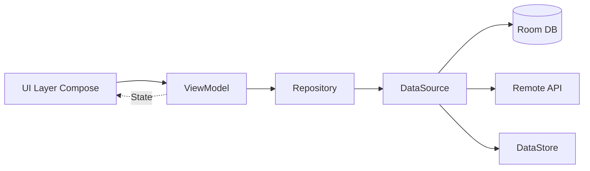

# RikkaHub 项目运行时状态

**最后更新时间**: 2025-11-02

## 📋 项目概览

- **项目名称**: RikkaHub
- **类型**: 原生Android LLM聊天客户端
- **语言**: Kotlin
- **UI框架**: Jetpack Compose
- **架构**: MVVM + Repository + Koin

## 🔧 开发环境要求

### 必需工具
- Android Studio Latest
- JDK 17
- Android SDK API 26+
- Gradle 8.11+

### 可选工具
- Bun(i18n工具)
- Git

## 🎨 设计规范

### UI设计系统
- **Material You**: 动态颜色主题
- **暗色模式**: 完整支持
- **自适应布局**: 多屏幕尺寸适配
- **预测性返回**: Android 13+手势

### 资源管理
- **多DPI支持**: mdpi, xxhdpi, xxxhdpi
- **自适应图标**: 前景+背景+单色
- **矢量图形**: XML drawable
- **自定义字体**: JetBrains Mono

### 支持平台
- Android 8.0+ (API 26+)
- 架构: ARM64, x86_64

## 💡 架构优势

### ✅ 优点
1. **模块化清晰**: 功能模块独立，职责明确
2. **技术栈现代**: Kotlin + Compose + Material You
3. **依赖注入**: Koin轻量级DI
4. **响应式设计**: Flow + StateFlow
5. **类型安全**: Kotlin强类型 + 序列化
6. **可测试性**: 分层架构便于测试
7. **性能优化**: Baseline Profile + 代码混淆

## 🔗 依赖管理

### 版本目录(Version Catalog)
- 文件: [`gradle/libs.versions.toml`](gradle/libs.versions.toml)
- 统一管理依赖版本
- 便于升级与维护

### 关键依赖版本
- AGP: 8.11.0
- Kotlin: 2.2.10
- Compose BOM: 2025.08.01
- Room: 2.7.2
- Koin: 4.1.1
- OkHttp: 5.1.0

## 📝 开发规范

### PR接受标准
✅ **接受**:
- Bug修复
- 性能优化
- 代码重构(小范围)
- 文档改进

❌ **拒绝**:
- 添加新语言
- 添加新功能(项目有态度)
- AI生成的大规模重构
- 未关联Issue的大改动

### 代码规范
- Kotlin编码风格
- 4空格缩进
- 120字符行宽(`.editorconfig`)
- 使用Kotlin反射谨慎

## 🔄 数据流架构

### MVVM + Repository模式



### 关键组件

1. **UI Layer**: Jetpack Compose组件
2. **ViewModel**: 状态管理与业务逻辑
3. **Repository**: 数据源协调
4. **DataSource**: 具体数据操作
5. **Room Database**: 本地持久化
6. **DataStore**: 偏好设置
7. **Remote API**: 网络请求


## 📂 项目结构分析

### 核心目录结构

```
AIfriend/
├── app/                          # 主应用模块
│   ├── src/main/
│   │   ├── java/me/rerere/rikkahub/
│   │   │   ├── RikkaHubApp.kt   # Application入口
│   │   │   ├── RouteActivity.kt # 主Activity
│   │   │   ├── data/            # 数据层
│   │   │   │   ├── ai/          # AI相关数据
│   │   │   │   ├── api/         # API定义
│   │   │   │   ├── datastore/   # 偏好设置
│   │   │   │   ├── db/          # Room数据库
│   │   │   │   ├── model/       # 数据模型
│   │   │   │   ├── repository/  # 仓储层
│   │   │   │   └── sync/        # 同步逻辑
│   │   │   ├── di/              # 依赖注入配置
│   │   │   ├── service/         # 服务层
│   │   │   ├── ui/              # UI层
│   │   │   │   ├── activity/
│   │   │   │   ├── components/  # 可复用组件
│   │   │   │   ├── context/     # Context相关
│   │   │   │   ├── hooks/       # Compose Hooks
│   │   │   │   ├── modifier/    # 自定义Modifier
│   │   │   │   ├── pages/       # 页面
│   │   │   │   └── theme/       # 主题配置
│   │   │   └── utils/           # 工具类
│   │   ├── assets/              # 静态资源
│   │   └── res/                 # Android资源
│   └── build.gradle.kts
├── ai/                           # AI SDK模块
│   └── src/main/java/me/rerere/ai/
│       ├── adapter/             # 类型适配器
│       ├── chat/                # 聊天核心
│       ├── error/               # 错误处理
│       └── provider/            # AI提供商实现
├── document/                     # 文档处理模块
├── search/                       # 搜索服务模块
├── tts/                         # TTS模块
├── highlight/                    # 代码高亮模块
├── common/                       # 通用模块
├── i18n/                        # 国际化工具
└── docs/                        # 文档资源
```

## 🚀 最新变更

### 移除 Firebase 功能

为了能在没有`google-services.json`文件的情况下编译和运行项目,我们进行了一系列代码修改。核心操作包括:

-   **构建脚本**: 从`app/build.gradle.kts`中移除了Firebase的Gradle插件和所有相关依赖库。
-   **代码清理**: 删除了`RikkaHubApp`, `AIRequestInterceptor`, `ChatVM`等文件中对Firebase (Analytics, Remote Config) 的直接引用和初始化逻辑。
-   **依赖注入**: 更新了Koin的DI模块(`AppModule`, `DataSourceModule`, `ViewModelModule`),移除了所有与Firebase组件相关的注入定义,解决了因此引发的编译时依赖解析错误。
-   **传递依赖**: 由于移除Firebase导致其传递依赖`Guava`丢失,我们在`gradle/libs.versions.toml`和`app/build.gradle.kts`中手动添加了`Guava`库,并修复了`ProviderBalanceText.kt`中相关的编译错误。
-   **警告修复**: 解决了`AcceptLang.kt`中因使用旧版Android API而产生的编译警告。

## 💡 当前状态

- **Firebase**: 已完全移除。项目不再需要`google-services.json`文件即��编译。
- **依赖**: 核心依赖为Jetpack Compose, Koin, Room, OkHttp, Retrofit等。
- **构建**: 项目现在应该可以干净地编译、构建和运行。

## 🔧 下一步建议

- **同步Gradle**: 确保Android Studio中的Gradle项目已经同步。
- **构建项目**: 运行`./gradlew build`或在Android Studio中构建项目,以验证所有修改是否正确。
- **运行应用**: 在模拟器或真实设备上运行`debug`构建变体。

---

**此文件旨在为AI提供上下文,以便在未来的会话中快速理解项目背景和当前状态。**